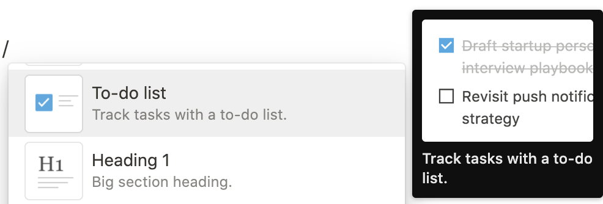
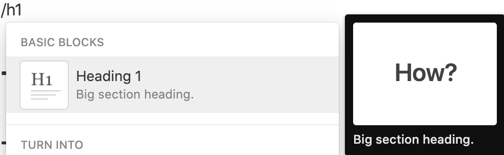
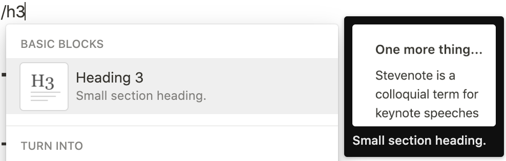

# ![ntast][banner]

**N**o**t**ion **A**bstract **S**yntax **T**ree.

> by [Notion Tweet].

---

**ntast** is a specification for representing [**Notion**][notion] pages in
[syntax trees][syntax-tree]. It implements the [**unist**][unist] specification.
It can represent different types of pages in Notion: [Page][notion-page],
[Table][notion-table], [Board][notion-board], [List][notion-list],
[Calendar][notion-calendar], [Gallery][notion-gallery], and
[Timeline][notion-timeline].

## Contents

- [Introduction](#introduction)
  - [Where this specification fits](#where-this-specification-fits)
  - [What this specification doesn't do](#what-this-specification-doesnt-do)
- [Nodes](#nodes)
  - [`Block`](#block)
  - [`Parent`](#parent)
  - [`Literal`](#literal)
  - [`Page`](#page)
  - [`Text`](#text)
  - [`ToDo`](#todo)
  - [`Heading1`](#heading1)
  - [`Heading2`](#heading2)
  - [`Heading3`](#heading3)
  - [`BulletedList`](#bulletedlist)
  - [`Divider`](#divider)
- [Content models](#content-models)
  - [`Content`](#content)
  - [`FlowContent`](#flowcontent)
  - [`InlineContent`](#inlinecontent)
- [Acknowledgements](#acknowledgements)
- [License](#license)

## Introduction

This document defines a format, written in [TypeScript], for representing
[Notion pages][notion-page] as [abstract syntax trees][syntax-tree].

### Where this specification fits

ntast extends [unist], a format for syntax trees, to benefit from its [ecosystem
of utilities][unist-utils].

ntast relates to [Notion] and Notion API in that it is designed to enable
reading from, applying complex transformations, and writing to Notion. It has a
set of utilities to transform between ntast syntax trees and Notion API schemas.

ntast relates to [unified] and unified-based projects in that it is designed to
work throughout their ecosystems.

ntast relates to [JavaScript] in that it has an ecosystem of utilities for
working with compliant syntax trees in JavaScript. However, ntast is not limited
to JavaScript and can be used in other programming languages.

### What this specification doesn't do

ntast focuses on only content and doesn't work with Notion-application data,
such as _Workspaces_, _Accounts_, _Members_, _Permissions_, and similar
settings. Ecosystem plugins may extend functionalities for these data using
Notion API.

ntast syntax trees may keep snapshots of Notion-application data to make
bidirectional transformation possible and that is the only purpose. Ecosystem
plugins **should not** directly access these snapshots.

## Nodes

### `Block`

```ts
interface Block extends UnistNode {
  id: UUID;
  version: number;
  createdTime: number;
  lastEditedTime: number;
  __raw__: unknown;
}
```

**Block** ([**UnistNode**][unist-node]) represents a node in ntast and [a
content block in Notion][notion-block].

Each block has a unique `id`, timestamps, and `__raw__` data for bidirectional
transformation with Notion API.

Example:

```jsonc
{
  "id": "b3e6e681-2eaa-4f1a-89c4-dde7f7f7a167",
  "type": "text",
  "version": 123,
  "createdTime": 1612532760000,
  "lastEditedTime": 1612763160000,
  "__raw__": {
    "id": "b3e6e681-2eaa-4f1a-89c4-dde7f7f7a167",
    "type": "text",
    "version": 123,
    "created_time": 1612532760000,
    "last_edited_time": 1612763160000
    // Other properties...
  }
}
```

### `Parent`

```ts
interface Parent extends UnistParent {
  children: Block[];
}
```

**Parent** ([**UnistParent**][unist-parent]) represents a node in ntast
containing other nodes (said to be [_children_][unist-child]).

Its `children` are limited to only [**Block**(s)](#block).

### `Literal`

```ts
interface Literal extends UnistLiteral {
  value: Inline[];
}
```

**Literal** ([**UnistLiteral**][unist-literal]) represents a node in ntast
containing a value.

Its `value` is an ordered list of [**Inline object**(s)](#inline).

### `Page`

```ts
interface Page extends Block, Parent, Literal {
  type: "page";
  icon?: string;
  cover?: string;
}
```

**Page** represents [a `Page` in Notion][notion-page].

A page can be the [_root_][unist-root] of a [_tree_][unist-tree] or a
[_child_][unist-child] of another page (also known as a subpage).

<p align="left"></p>

A subpage may have its `children` lazy loaded:

- `children = undefined` means it wasn't loaded.
- `children = []` means it was loaded and is empty.

Example:

<p align="left"></p>

Yields:

```js
{
  id: "b3e6e681-2eaa-4f1a-89c4-dde7f7f7a167",
  type: "page",
  value: [["This is a subpage"]],
  icon: "☺️"
}
```

### `Text`

```ts
interface Text extends Block, Literal {
  type: "text";
}
```

**Text** represents [a `Text` block in Notion][notion-basic-blocks].

<p align="left"></p>

Example:

<p align="left"></p>

Yields:

```js
{
  id: "333f9503-77f2-45b3-92df-89e2094fb354",
  type: "text",
  value: [
    ["Tools you're familiar with will just work: "],
    ["bold", [["b"]]],
    [", "],
    ["italic", [["i"], ["b"]]],
    [", "],
    ["strikethrough", [["s"]]],
    [", "],
    ["code", [["c"]]],
    [", and more."],
  ],
};
```

### `ToDo`

```ts
interface ToDo extends Block, Literal {
  type: "to_do";
  checked: boolean;
}
```

**ToDo** represents [a `To-do list` block in Notion][notion-basic-blocks].

<p align="left"></p>

Example:

<p align="left"></p>
<p align="left"></p>

Yields:

```js
// Before
{
  id: "8b3cfeed-c0da-451e-8f18-f7086c321979",
  type: "to_do",
  value: [["This is a "], ["todo", [["b"]]], [" item."]],
}
// After
{
  id: "8b3cfeed-c0da-451e-8f18-f7086c321979",
  type: "to_do",
  value: [["This is a "], ["todo", [["b"]]], [" item."]],
  checked: true
}
```

### `Heading1`

```ts
interface Heading1 extends Block, Literal {
  type: "header";
}
```

**Heading1** represents [a `Heading 1` block in Notion][notion-basic-blocks].

<p align="left"></p>

Example:

<p align="left"></p>

Yields:

```js
{
  id: "f694bbd6-8fa4-44d4-b02c-ad05128fb277",
  type: "header",
  value: [["This is heading 1"]],
};
```

### `Heading2`

```ts
interface Heading2 extends Block, Literal {
  type: "sub_header";
}
```

**Heading2** represents [a `Heading 2` block in Notion][notion-basic-blocks].

<p align="left"></p>

Example:

<p align="left"></p>

Yields:

```js
{
  id: "f694bbd6-8fa4-44d4-b02c-ad05128fb277",
  type: "sub_header",
  value: [["This is heading 2"]],
};
```

### `Heading3`

```ts
interface Heading3 extends Block, Literal {
  type: "sub_sub_header";
}
```

**Heading3** represents [a `Heading 3` block in Notion][notion-basic-blocks].

<p align="left"></p>

Example:

<p align="left"></p>

Yields:

```js
{
  id: "f694bbd6-8fa4-44d4-b02c-ad05128fb277",
  type: "sub_sub_header",
  value: [["This is heading 3"]],
};
```

### `BulletedList`

```ts
interface BulletedList extends Block, Literal, Parent {
  type: "bulleted_list";
}
```

**BulletedList** represents [a `Bulleted list` block in
Notion][notion-basic-blocks]. It may has children.

<p align="left"></p>

Example:

<p align="left"></p>

Yields:

```js
[
  {
    id: "dd130b72-3d53-42ea-bf3b-45e95c8e8c2d",
    type: "bulleted_list",
    value: [
      ["Heading 1", [["c"]]],
      [": The largest heading, can be easily added with shortcut "],
      ["/h1", [["c"]]],
      ["."],
    ],
  },
  {
    id: "093db819-617f-47b0-b776-48abf0ff2792",
    type: "bulleted_list",
    value: [
      ["Heading 2", [["c"]]],
      [": The medium-sized heading, can be easily added with shortcut "],
      ["/h2", [["c"]]],
      ["."],
    ],
  },
  {
    id: "b7d35804-e262-4d99-b039-8372470262f6",
    type: "bulleted_list",
    value: [
      ["Heading 3", [["c"]]],
      [": The smallest heading, can be easily added with shortcut "],
      ["/h3", [["c"]]],
      ["."],
    ],
  },
];
```

### `Divider`

```ts
interface Divider extends Omit<Block, "title"> {
  type: "divider";
}
```

**Divider** ([**Block**](#block)) represents a divider block in Notion. It has
no content. It is an equivalence to
[**MdastThematicBreak**][mdast-thematicbreak].

## Content models

### `Content`

```ts
type Content = FlowContent | InlineContent;
```

Each node in ntast falls into one or more categories of content that group nodes
with similar characteristics together.

### `FlowContent`

```ts
type FlowContent = Block | Text | Divider | ToDo | BulletedList;
```

### `InlineContent`

```ts
type InlineContent = unknown;
```

## Acknowledgements

ntast is created and maintained by the creator of [Notion Tweet].

> [Notion Tweet] is a tool that enables writing, scheduling, and automating your
> tweets 10x easier and faster, directly in Notion.

Special thanks to [@wooorm](https://github.com/wooorm) for his work on [unist],
[mdast], and [unified], by which this project is heavily inspired.

## License

[CC-BY-4.0](/LICENSE) © [Minh-Phuc Tran][@phuctm97].

<!-- Definitions -->

[@phuctm97]: https://twitter.com/phuctm97
[banner]: /banner.svg
[notion tweet]: https://notiontweet.app
[notion]: https://notion.so
[unified]: https://github.com/unifiedjs/unified
[unified-api]: https://github.com/unifiedjs/unified#description
[syntax-tree]: https://github.com/syntax-tree/unist#syntax-tree
[unist]: https://github.com/syntax-tree/unist
[mdast]: https://github.com/syntax-tree/mdast
[javascript]: https://developer.mozilla.org/en-US/docs/Web/JavaScript
[typescript]: https://www.typescriptlang.org
[notion-page]:
  https://www.notion.so/Create-a-new-page-6c3fe9aad94749099ea4bdfc072e5f97
[notion-table]:
  https://www.notion.so/Intro-to-databases-fd8cd2d212f74c50954c11086d85997e#619bd05f7a004dd586aa6625688e9b02
[notion-board]:
  https://www.notion.so/Intro-to-databases-fd8cd2d212f74c50954c11086d85997e#2a6fd1048c554fc5867e984a65f81b5c
[notion-list]:
  https://www.notion.so/Intro-to-databases-fd8cd2d212f74c50954c11086d85997e#43004898727e439bbbc4973251c97888
[notion-calendar]:
  https://www.notion.so/Intro-to-databases-fd8cd2d212f74c50954c11086d85997e#ad61402f93a84d0fad0d833b09f46610
[notion-gallery]:
  https://www.notion.so/Intro-to-databases-fd8cd2d212f74c50954c11086d85997e#5f5e4e9b5a534445bb1f941093ada5d9
[notion-timeline]:
  https://www.notion.so/Intro-to-databases-fd8cd2d212f74c50954c11086d85997e#184b7b79134647f3a5c5ad3f01f20730
[notion-block]:
  https://www.notion.so/Writing-editing-basics-68c7c67047494fdb87d50185429df93e#8c31584e7c514630b9ebb86afe1125b1
[notion-basic-blocks]:
  https://www.notion.so/Writing-editing-basics-68c7c67047494fdb87d50185429df93e#73916b435b674a85b10a165e96d1114e
[unist-utils]: https://github.com/syntax-tree/unist#list-of-utilities
[unist-node]: https://github.com/syntax-tree/unist#node
[unist-parent]: https://github.com/syntax-tree/unist#parent
[unist-child]: https://github.com/syntax-tree/unist#child
[unist-literal]: https://github.com/syntax-tree/unist#literal
[unist-root]: https://github.com/syntax-tree/unist#root
[unist-tree]: https://github.com/syntax-tree/unist#tree
[mdast-paragraph]: https://github.com/syntax-tree/mdast#paragraph
[mdast-thematicbreak]: https://github.com/syntax-tree/mdast#thematicbreak
[mdast-list]: https://github.com/syntax-tree/mdast#list
