# ![ntast][banner]

**N**o**t**ion **A**bstract **S**yntax **T**ree.

> by [Notion Tweet].

---

**ntast** is a specification for representing [**Notion contents**][notion] as
[**abstract syntax trees**][syntax-tree]. It implements the [**unist**][unist]
specification. It can represent different types of pages in Notion:
[Page][notion-page], [Table][notion-table], [Board][notion-board],
[List][notion-list], [Calendar][notion-calendar], [Gallery][notion-gallery], and
[Timeline][notion-timeline].

## Contents

- [Introduction](#introduction)
  - [Where this specification fits](#where-this-specification-fits)
  - [What this specification isn't about](#what-this-specification-isnt-about)
- [Nodes](#nodes)
  - [`Block`](#block)
  - [`Parent`](#parent)
  - [`Literal`](#literal)
  - [`Page`](#page)
  - [`Text`](#text)
  - [`ToDo`](#todo)
  - [`Heading1`](#heading1)
  - [`Heading2`](#heading2)
  - [`Heading3`](#heading3)
  - [`BulletedList`](#bulletedlist)
  - [`NumberedList`](#numberedlist)
  - [`ToggleList`](#togglelist)
  - [`Quote`](#quote)
  - [`Divider`](#divider)
  - [`LinkToPage`](#linktopage)
  - [`Callout`](#callout)
- [Content formats](#content-formats)
  - [`Value`](#value)
  - [`TextValue`](#textvalue)
  - [`ReferenceValue`](#referencevalue)
  - [`EquationValue`](#equationvalue)
- [Acknowledgements](#acknowledgements)
- [Contributors](#contributors)
- [Related projects](#related-projects)
- [License](#license)

## Introduction

This document defines a format, written in [TypeScript], for representing
[Notion contents][notion] as [abstract syntax trees][syntax-tree].

### Where this specification fits

ntast extends [unist], a format for syntax trees, to benefit from [its ecosystem
of utilities][unist-utils], [unified], and [unified ecosystem].

ntast relates to [Notion] in that it enables reading from, applying
transformations, and writing to Notion. It has a set of utilities to transform
between ntast syntax trees and Notion API schemas.

ntast relates to [JavaScript] in that it has an ecosystem of utilities for
working with compliant syntax trees in JavaScript. However, ntast is not limited
to JavaScript and can be used in other programming languages.

### What this specification isn't about

ntast focuses on only content and doesn't work with Notion-application data,
such as _Workspaces_, _Accounts_, _Members_, _Permissions_, and similar
settings. Ecosystem plugins may extend functionalities for these data using
Notion API.

## Nodes

### `Block`

```ts
interface Block extends UnistNode {
  id: string;
}
```

**Block** ([**UnistNode**][unist-node]) represents a node in ntast and [a
content block in Notion][notion-block].

Each block has a unique `id`.

Example:

```js
{
  id: "b3e6e681-2eaa-4f1a-89c4-dde7f7f7a167",
  type: "text",
};
```

### `Parent`

```ts
interface Parent extends UnistParent {
  children: Block[];
}
```

**Parent** ([**UnistParent**][unist-parent]) represents a node in ntast
containing other nodes (said to be [_children_][unist-child]).

Its `children` are limited to only [**Block**(s)](#block).

### `Literal`

```ts
interface Literal extends UnistLiteral {
  value: Value[];
}
```

**Literal** ([**UnistLiteral**][unist-literal]) represents a node in ntast
containing a value.

Its `value` is an ordered list of [**Value object**(s)](#value).

### `Page`

```ts
interface Page extends Block, Parent, Literal {
  type: "page";
  icon?: string;
  cover?: string;
}
```

**Page** represents [a `Page` in Notion][notion-page].

A page can be the [_root_][unist-root] of a [_tree_][unist-tree] or a
[_child_][unist-child] of another page (known as a sub-page in Notion).

<p align="left">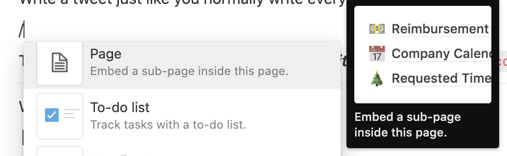</p>

Example:

<p align="left"></p>

Yields:

```js
{
  id: "b3e6e681-2eaa-4f1a-89c4-dde7f7f7a167",
  type: "page",
  value: [["This is a subpage"]],
  icon: "☺️",
  children: [],
};
```

### `Text`

```ts
interface Text extends Block, Literal {
  type: "text";
}
```

**Text** represents [a `Text` block in Notion][notion-basic-blocks].

<p align="left">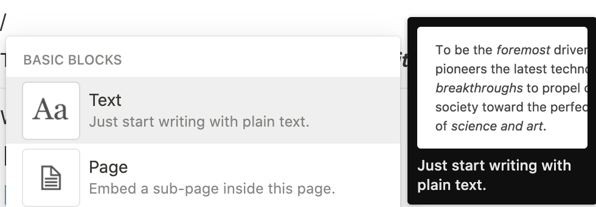</p>

Example:

<p align="left">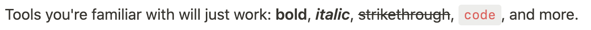</p>

Yields:

```js
{
  id: "333f9503-77f2-45b3-92df-89e2094fb354",
  type: "text",
  value: [
    ["Tools you're familiar with will just work: "],
    ["bold", [["b"]]],
    [", "],
    ["italic", [["i"], ["b"]]],
    [", "],
    ["strikethrough", [["s"]]],
    [", "],
    ["code", [["c"]]],
    [", and more."],
  ],
};
```

### `ToDo`

```ts
interface ToDo extends Block, Literal {
  type: "to_do";
  checked: boolean;
}
```

**ToDo** represents [a `To-do list` block in Notion][notion-basic-blocks].

<p align="left"></p>

Example:

<p align="left"></p>
<p align="left"></p>

Yields:

```js
[
  {
    id: "8b3cfeed-c0da-451e-8f18-f7086c321979",
    type: "to_do",
    value: [["This is a "], ["todo", [["b"]]], [" item."]],
  },
  {
    id: "8b3cfeed-c0da-451e-8f18-f7086c321979",
    type: "to_do",
    value: [["This is a "], ["todo", [["b"]]], [" item."]],
    checked: true,
  },
];
```

### `Heading1`

```ts
interface Heading1 extends Block, Literal {
  type: "header";
}
```

**Heading1** represents [a `Heading 1` block in Notion][notion-basic-blocks].

<p align="left"></p>

Example:

<p align="left"></p>

Yields:

```js
{
  id: "f694bbd6-8fa4-44d4-b02c-ad05128fb277",
  type: "header",
  value: [["This is heading 1"]],
};
```

### `Heading2`

```ts
interface Heading2 extends Block, Literal {
  type: "sub_header";
}
```

**Heading2** represents [a `Heading 2` block in Notion][notion-basic-blocks].

<p align="left">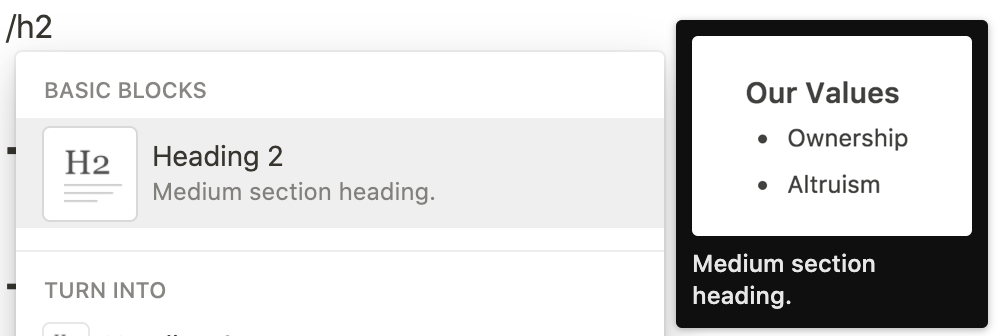</p>

Example:

<p align="left"></p>

Yields:

```js
{
  id: "f694bbd6-8fa4-44d4-b02c-ad05128fb277",
  type: "sub_header",
  value: [["This is heading 2"]],
};
```

### `Heading3`

```ts
interface Heading3 extends Block, Literal {
  type: "sub_sub_header";
}
```

**Heading3** represents [a `Heading 3` block in Notion][notion-basic-blocks].

<p align="left"></p>

Example:

<p align="left"></p>

Yields:

```js
{
  id: "f694bbd6-8fa4-44d4-b02c-ad05128fb277",
  type: "sub_sub_header",
  value: [["This is heading 3"]],
};
```

### `BulletedList`

```ts
interface BulletedList extends Block, Literal, Parent {
  type: "bulleted_list";
}
```

**BulletedList** represents [a `Bulleted list` block in
Notion][notion-basic-blocks]. It can have children.

<p align="left"></p>

Example:

<p align="left">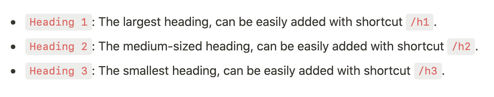</p>

Yields:

```js
[
  {
    id: "dd130b72-3d53-42ea-bf3b-45e95c8e8c2d",
    type: "bulleted_list",
    value: [
      ["Heading 1", [["c"]]],
      [": The largest heading, can be easily added with shortcut "],
      ["/h1", [["c"]]],
      ["."],
    ],
    children: [],
  },
  {
    id: "093db819-617f-47b0-b776-48abf0ff2792",
    type: "bulleted_list",
    value: [
      ["Heading 2", [["c"]]],
      [": The medium-sized heading, can be easily added with shortcut "],
      ["/h2", [["c"]]],
      ["."],
    ],
    children: [],
  },
  {
    id: "b7d35804-e262-4d99-b039-8372470262f6",
    type: "bulleted_list",
    value: [
      ["Heading 3", [["c"]]],
      [": The smallest heading, can be easily added with shortcut "],
      ["/h3", [["c"]]],
      ["."],
    ],
    children: [],
  },
];
```

## `NumberedList`

```ts
interface NumberedList extends Block, Literal, Parent {
  type: "numbered_list";
}
```

**NumberedList** represents [a `Numbered list` block in
Notion][notion-basic-blocks]. It can have children.

<p align="left"></p>

Example:

<p align="left">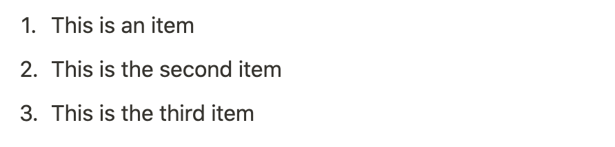</p>

Yields:

```js
[
  {
    id: "a405f18e-978e-4c80-9055-1def35f84b47",
    type: "numbered_list",
    value: [["This is an item"]],
    children: [],
  },
  {
    id: "385a10b8-f1fa-49b0-a704-02a109c92953",
    type: "numbered_list",
    value: [["This is the second item"]],
    children: [],
  },
  {
    id: "8c6225e1-78b1-4e8d-b658-adc6e2b045ea",
    type: "numbered_list",
    value: [["This is the third item"]],
    children: [],
  },
];
```

## `ToggleList`

```ts
interface ToggleList extends Block, Literal, Parent {
  type: "toggle";
}
```

**ToggleList** represents [a `Toggle list` block in
Notion][notion-basic-blocks]. It can have children.

<p align="left">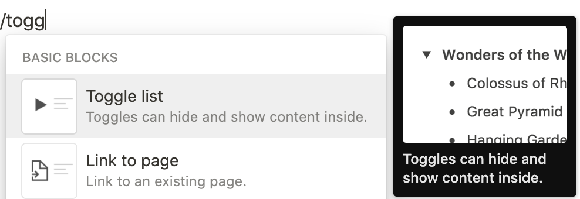</p>

Example:

<p align="left"></p>

Yields:

```js
{
  id: "edf810ae-1684-491d-a6c1-673ad2d3fc57",
  type: "toggle",
  value: [["This is a "], ["toggle", [["b"]]], [" "], ["list", [["i"]]]],
  children: [
    {
      id: "689aa04d-d448-48b2-93fa-edbcc93c34d8",
      type: "text",
      value: [["This is a child block."]],
    },
  ],
};
```

### `Quote`

```ts
interface Quote extends Block, Literal {
  type: "quote";
}
```

**Quote** represents [a `Quote` block in Notion][notion-basic-blocks].

<p align="left">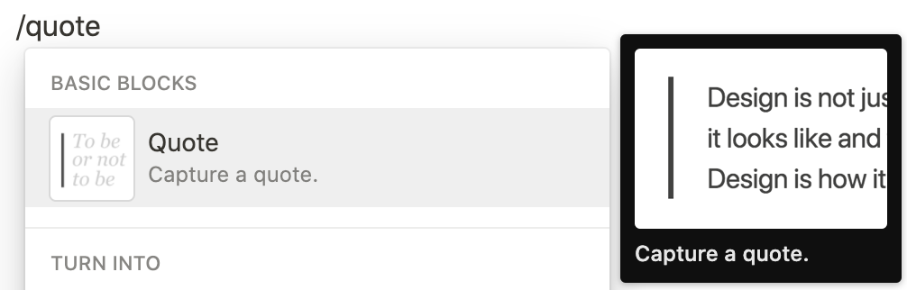</p>

Example:

<p align="left"></p>

Yields:

```js
{
  id: "d3a9da64-26e3-44b3-a22a-99a6b02880d3",
  type: "quote",
  value: [
    [
      '"The way to get started is to quit talking and begin doing." - Walt Disney',
    ],
  ],
};
```

### `Divider`

```ts
interface Divider extends Block {
  type: "divider";
}
```

**Divider** represents [a `Divider` block in Notion][notion-basic-blocks]. It
has no content.

<p align="left">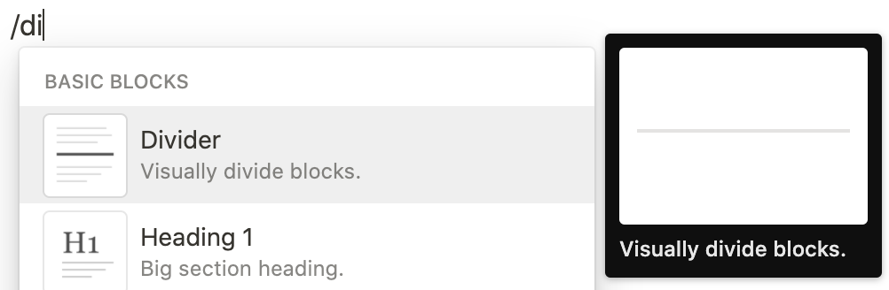</p>

Yields:

```js
{
  id: "95ee567a-527f-4020-aa6a-e4c170de031c",
  type: "divider",
};
```

### `LinkToPage`

```ts
type LinkToPage = Page;
```

**LinkToPage** represents [a `Link to page` block in
Notion][notion-basic-blocks]. It is an alias to [**Page**](#page).

<p align="left">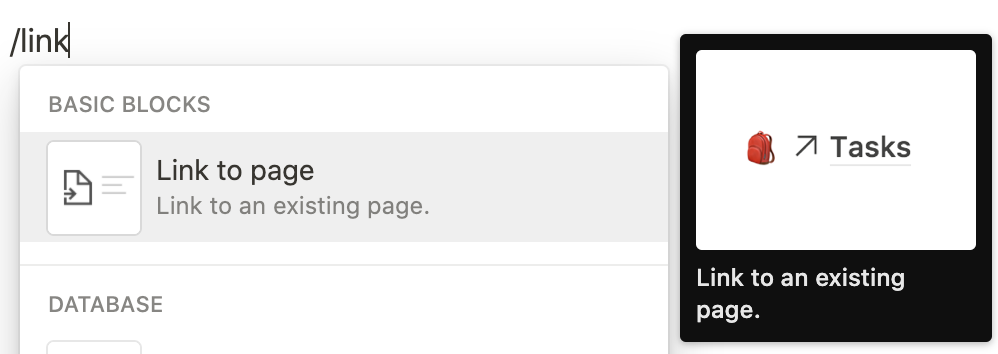</p>

### `Callout`

```ts
interface Callout extends Block, Literal {
  type: "callout";
  icon: string;
  color: Color;
}
```

**Callout** represents [a `Callout` block in Notion][notion-callout].

<p align="left">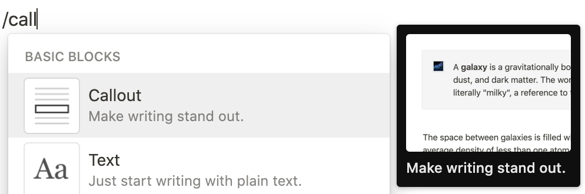</p>

Example:

<p align="left">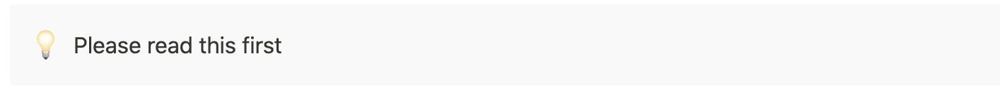</p>

Yields:

```js
{
  id: "5cc11b17-3ee0-4f09-8cca-659e56851db7",
  type: "callout",
  value: [["Please read this first"]],
  icon: "💡",
  color: "gray_background",
};
```

## Content formats

### `Value`

```ts
type Value = TextValue | ReferenceValue | EquationValue;
```

**Value** represents an inline literal in Notion, which can be either
[**text**](#textvalue), or [**reference**](#referencevalue), or
[**equation**](#equationvalue).

### `TextValue`

```ts
type TextValue = [string, TextFormat[]?];

type TextFormat =
  | BoldFormat
  | ItalicFormat
  | StrikethroughFormat
  | CodeFormat
  | UnderlineFormat
  | LinkFormat
  | HighlightFormat;

type BoldFormat = ["b"];
type ItalicFormat = ["i"];
type StrikethroughFormat = ["s"];
type CodeFormat = ["c"];
type UnderlineFormat = ["_"];
type LinkFormat = ["a", string];
type HighlightFormat = ["h", Color];

type Color =
  | "gray"
  | "brown"
  | "orange"
  | "yellow"
  | "teal"
  | "blue"
  | "purple"
  | "pink"
  | "red"
  | "gray_background"
  | "brown_background"
  | "orange_background"
  | "yellow_background"
  | "teal_background"
  | "blue_background"
  | "purple_background"
  | "pink_background"
  | "red_background";
```

**TextValue** represents a text literal in Notion, which can have [styling
options][notion-styling].

Example:

<p align="left">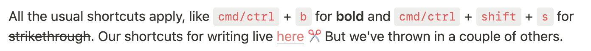</p>

Yields:

```js
[
  ["All the usual shortcuts apply, like "],
  ["cmd/ctrl", [["c"]]],
  [" + "],
  ["b", [["c"]]],
  [" for "],
  ["bold", [["b"]]],
  [" and "],
  ["cmd/ctrl", [["c"]]],
  [" + "],
  ["shift", [["c"]]],
  [" + "],
  ["s", [["c"]]],
  [" for "],
  ["strikethrough", [["s"]]],
  [". Our shortcuts for writing live "],
  [
    "here",
    [
      [
        "a",
        "https://notion.so/notion/Keyboard-Markdown-Shortcuts-66e28cec810548c3a4061513126766b0",
      ],
      ["h", "red"],
    ],
  ],
  [" ✂️ But we've thrown in a couple others."],
];
```

### `ReferenceValue`

```ts
type ReferenceValue = ["‣", ReferenceFormat[]?];

type ReferenceFormat = UserFormat | PageFormat | DateFormat;

type UserFormat = ["u", string];
type PageFormat = ["p", string];
type DateFormat = [
  "d",
  {
    type: "date" | "daterange";
    start: string;
    end?: string;
    format?: string;
  }
];
```

**ReferenceValue** represents a reference literal in Notion.

Example:

<p align="left">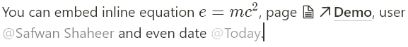</p>

Yields:

```js
[
  // Others...
  [", page "],
  ["‣", [["p", "57dcb2ae-4528-4939-8207-9ed5d1e01809"]]],
  [", user "],
  ["‣", [["u", "62e85506-1758-481a-92b1-73984a903451"]]],
  [" and even date "],
  [
    "‣",
    [
      [
        "d",
        {
          type: "date",
          start_date: "2021-02-18",
          date_format: "relative",
        },
      ],
    ],
  ],
  ["."],
];
```

### `EquationValue`

```ts
type EquationValue = ["⁍", EquationFormat[]?];

type EquationFormat = ["e", string];
```

**EquationValue** represent an equation literal in Notion.

Example:

<p align="left"></p>

Yields:

```js
[
  ["You can embed inline equation "],
  ["⁍", [["e", "e = mc^2"]]],
  // Others...
];
```

## Acknowledgements

ntast is created and maintained by the creator of [Notion Tweet].

> [Notion Tweet] is a tool that enables writing, scheduling, and automating your
> tweets 10x easier and faster, directly in Notion.

Special thanks to [@wooorm](https://github.com/wooorm) for his work on [unist],
[mdast], and [unified], by which this project is heavily inspired.

## Contributors

- [Minh-Phuc Tran][@phuctm97]
- [Safwan Shaheer](https://github.com/Devorein)

## Related projects

- [Nishan](https://github.com/Devorein/Nishan)
- [react-notion-x](https://github.com/NotionX/react-notion-x)

## License

[CC-BY-4.0](/LICENSE) © [Minh-Phuc Tran][@phuctm97].

<!-- Definitions -->

[@phuctm97]: https://twitter.com/phuctm97
[banner]: /banner.svg
[notion tweet]: https://notiontweet.app
[notion]: https://notion.so
[unified]: https://github.com/unifiedjs/unified
[unified api]: https://github.com/unifiedjs/unified#description
[unified ecosystem]: https://unifiedjs.com/explore
[syntax-tree]: https://github.com/syntax-tree/unist#syntax-tree
[unist]: https://github.com/syntax-tree/unist
[mdast]: https://github.com/syntax-tree/mdast
[javascript]: https://developer.mozilla.org/en-US/docs/Web/JavaScript
[typescript]: https://www.typescriptlang.org
[notion-page]:
  https://www.notion.so/Create-a-new-page-6c3fe9aad94749099ea4bdfc072e5f97
[notion-table]:
  https://www.notion.so/Intro-to-databases-fd8cd2d212f74c50954c11086d85997e#619bd05f7a004dd586aa6625688e9b02
[notion-board]:
  https://www.notion.so/Intro-to-databases-fd8cd2d212f74c50954c11086d85997e#2a6fd1048c554fc5867e984a65f81b5c
[notion-list]:
  https://www.notion.so/Intro-to-databases-fd8cd2d212f74c50954c11086d85997e#43004898727e439bbbc4973251c97888
[notion-calendar]:
  https://www.notion.so/Intro-to-databases-fd8cd2d212f74c50954c11086d85997e#ad61402f93a84d0fad0d833b09f46610
[notion-gallery]:
  https://www.notion.so/Intro-to-databases-fd8cd2d212f74c50954c11086d85997e#5f5e4e9b5a534445bb1f941093ada5d9
[notion-timeline]:
  https://www.notion.so/Intro-to-databases-fd8cd2d212f74c50954c11086d85997e#184b7b79134647f3a5c5ad3f01f20730
[notion-block]:
  https://www.notion.so/Writing-editing-basics-68c7c67047494fdb87d50185429df93e#8c31584e7c514630b9ebb86afe1125b1
[notion-basic-blocks]:
  https://www.notion.so/Writing-editing-basics-68c7c67047494fdb87d50185429df93e#73916b435b674a85b10a165e96d1114e
[notion-callout]:
  https://www.notion.so/Callout-blocks-5b2638247b54447eb2e21145f97194b0
[notion-inline]:
  https://www.notion.so/Writing-editing-basics-68c7c67047494fdb87d50185429df93e#7a4ade361ccc4ce881df56036f125e0d
[notion-styling]:
  https://www.notion.so/Writing-editing-basics-68c7c67047494fdb87d50185429df93e#7527efecd76a458bba251c267209a5c2
[unist-utils]: https://github.com/syntax-tree/unist#list-of-utilities
[unist-node]: https://github.com/syntax-tree/unist#node
[unist-parent]: https://github.com/syntax-tree/unist#parent
[unist-child]: https://github.com/syntax-tree/unist#child
[unist-literal]: https://github.com/syntax-tree/unist#literal
[unist-root]: https://github.com/syntax-tree/unist#root
[unist-tree]: https://github.com/syntax-tree/unist#tree
[mdast-paragraph]: https://github.com/syntax-tree/mdast#paragraph
[mdast-thematicbreak]: https://github.com/syntax-tree/mdast#thematicbreak
[mdast-list]: https://github.com/syntax-tree/mdast#list
